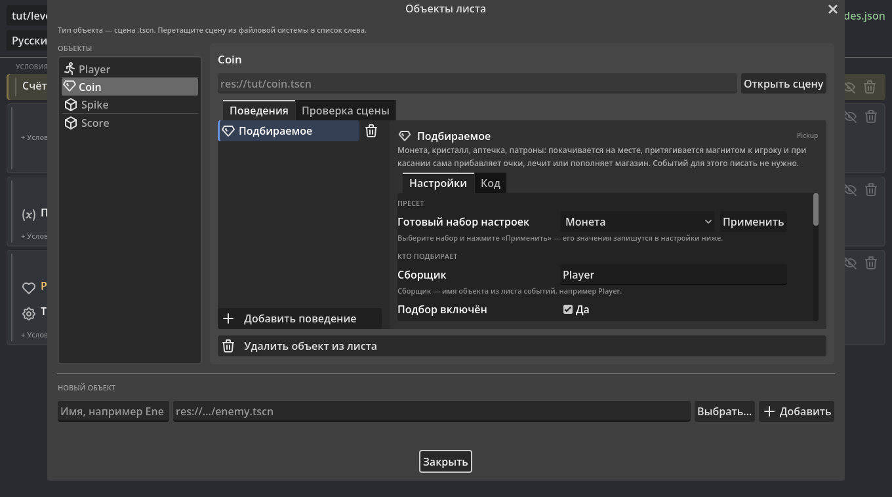
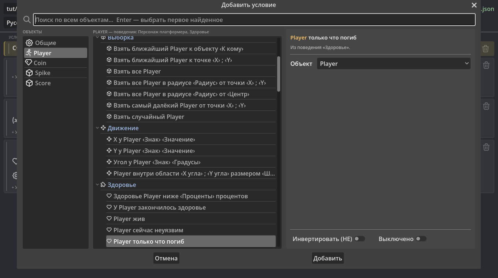
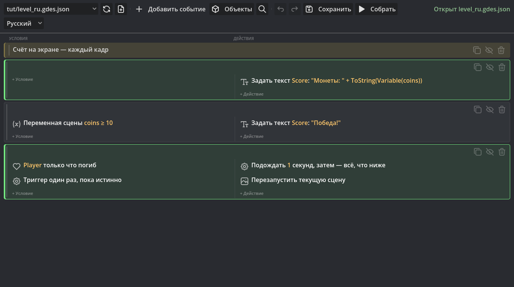

# Первая игра за 15 минут

[English](TUTORIAL.md) · **Русский**

Маленький платформер: герой бегает и прыгает, собирает монеты, шипы
отнимают здоровье, а после гибели уровень начинается заново. Готовые
способности (бег, прыжок, подбор монет, урон, здоровье) дают **поведения** —
для них не нужно ни одного события. События понадобятся только для счёта на
экране, победы и перезапуска.

Понадобится Godot 4.7 с включённым плагином GDevents (см. «Установку» в
README) и любые картинки: персонаж, монета, шипы, кусок земли.

## 1. Сцены объектов

В GDevents **объект — это сцена** `.tscn`. Сделайте четыре пустые сцены:
**Сцена → Новая сцена → Другой узел → Node2D** и сохраните их как
`player.tscn`, `coin.tscn`, `spike.tscn`. Для счёта сделайте сцену с корнем
**Label** и сохраните как `score.tscn`.

## 2. Лист событий и объекты

1. Откройте вкладку **«События»** (рядом с 2D / 3D / Script) и нажмите
   **«Создать новый лист»**. Назовите его `level.gdes.json`.
2. Нажмите **«Объекты»**. Внизу, в «Новом объекте», впишите имя `Player`,
   нажмите **«Выбрать…»**, укажите `player.tscn` и нажмите **«Добавить»**.
   Так же добавьте `Coin` (`coin.tscn`), `Spike` (`spike.tscn`) и `Score`
   (`score.tscn`).

## 3. Поведения — вся механика без событий

В том же окне выберите объект слева и нажмите **«Добавить поведение»**.

| Объект | Поведение | Что настроить справа |
| --- | --- | --- |
| Player | **Персонаж платформера** | Ничего не обязательно; можно выбрать пресет «Классический» |
| Player | **Здоровье** | «Запас здоровья»: 3; включите «Мигание при получении урона» |
| Coin | **Подбираемое** | Пресет «Монета»; «Сборщик»: `Player`; «Имя переменной»: `coins` |
| Spike | **Урон при касании** | Пресет «Шипы»; «Жертва»: `Player`; «Урон за одно попадание»: 1 |

Пресет — готовый набор настроек: выберите его в списке «Готовый набор
настроек» и нажмите «Применить», и его значения запишутся в настройки ниже.

Поведение само добавляет в сцену то, чего ему не хватает: «Персонаж
платформера» превращает сцену в `CharacterBody2D` с формой столкновения и
`AnimatedSprite2D`. Откройте сцены (**«Открыть сцену»**) и дайте спрайтам
картинки. Если что-то забыто — вкладка **«Проверка сцены»** скажет что и
предложит исправить одной кнопкой.



## 4. Уровень

Создайте сцену `level.tscn` с корнем **Node2D**. Перетащите в неё
`player.tscn`, несколько `coin.tscn` и `spike.tscn`, а `score.tscn` — в угол
экрана. Пол — **StaticBody2D** с **CollisionShape2D** (прямоугольник) и
картинкой.

## 5. События

Вернитесь во вкладку «События». Каждое событие добавляется кнопкой
**«Добавить событие»**, условие и действие — строками **«+ Условие»** и
**«+ Действие»** внутри него. В окне выбора слева выбирают объект, справа —
инструкцию; значения вписываются внизу окна.



1. **Счёт на экране.** Событие без условий (оно выполняется каждый кадр).
   Действие: объект `Score` → «Задать текст» → `"Монеты: " + ToString(Variable(coins))`.
2. **Победа.** Условие: «Общие» → «Переменная сцены» `coins` `≥` `10`.
   Действия: «Задать текст» у `Score` → `"Победа!"`.
3. **Гибель и перезапуск.** Условия: объект `Player` → «Только что погиб»
   (поведение «Здоровье») и «Общие» → «Триггер один раз». Действия:
   «Подождать» `1` секунду, затем «Перезапустить текущую сцену».

Порядок важен: события выполняются сверху вниз, поэтому «Победа» стоит после
счёта и перезаписывает его текст.

## 6. Запуск

Нажмите **«Привязать к сцене…»** на жёлтой полосе и выберите `level.tscn`.
Запустите сцену (F6). Лист сохраняется и собирается сам перед каждым
запуском.

Пока игра идёт, сработавшие события подсвечиваются в листе зелёным, а во
вкладке **GDevents** внизу, в отладчике Godot, видно значение `coins`.



## Итоговый лист

Так выглядит `level.gdes.json` после шага 5 — его можно открыть и как
текст. Этот лист проверяется тестами плагина: если урок разойдётся с
библиотекой, тест упадёт.

```json
{
  "format": 2,
  "name": "level",
  "extends": "Node2D",
  "objects": [
    { "name": "Player", "scene": "res://player.tscn" },
    { "name": "Coin", "scene": "res://coin.tscn" },
    { "name": "Spike", "scene": "res://spike.tscn" },
    { "name": "Score", "scene": "res://score.tscn" }
  ],
  "variables": { "coins": 0 },
  "events": [
    { "type": "comment", "text": "Счёт на экране — каждый кадр" },
    {
      "type": "standard",
      "conditions": [],
      "actions": [
        { "id": "object.set_text", "params": ["Score", "\"Монеты: \" + ToString(Variable(coins))"] }
      ]
    },
    {
      "type": "standard",
      "conditions": [
        { "id": "var.compare", "params": ["coins", "≥", "10"] }
      ],
      "actions": [
        { "id": "object.set_text", "params": ["Score", "\"Победа!\""] }
      ]
    },
    {
      "type": "standard",
      "conditions": [
        { "id": "Health::just_died", "params": ["Player"] },
        { "id": "system.trigger_once", "params": [] }
      ],
      "actions": [
        { "id": "system.wait", "params": ["1"] },
        { "id": "scene.restart", "params": [] }
      ]
    }
  ]
}
```

## Что дальше

- [Справочник инструкций](REFERENCE.ru.md) — все условия, действия и
  выражения с описаниями.
- [Руководство по плагину](../README.ru.md) — выборка объектов, функции из
  событий, общие листы, локальные переменные.
- Своё поведение или расширение — [руководство для авторов](AUTHORING.md).
